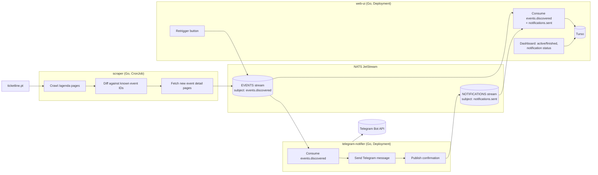

# Ticket Live Event Scanner — System Design

Status: confirmed v1.0 — all decisions settled, see §10 for confirmation log

## 1. Goal

Watch ticketline.pt for new events, notify a Telegram chat/channel when one
appears, track whether that notification was actually delivered, and give a
small web dashboard to see event status (active / finished) and notification
status (pending / sent / failed), with a manual "retry" action.

## 2. Decisions made so far

| Question | Decision |
|---|---|
| Scraper scope | **Tracked hub pages only**: re-check the 2 known venue/series hub URLs for new session IDs, no site-wide `/agenda`/`/pesquisa` crawling (revised — see §10) |
| Language/runtime | **Go** for all three services |
| Deployment | **Kubernetes** |
| State store | **Turso** (libSQL / distributed SQLite) as the queryable source of truth for the web UI |
| Message bus | **NATS JetStream**, self-hosted in-cluster |
| Telegram target | Single fixed chat/channel (one bot token + one chat ID) |
| Web UI exposure | Cluster-internal only, no auth (not internet-facing) |
| Web UI stack | Go JSON API + separate JS frontend |
| Web UI packaging | Separate pods/Deployments for API and frontend |
| Scrape frequency | Hourly (`0 * * * *` CronJob schedule) |

## 3. Non-goals (v1)

- Re-scraping known events for in-page changes (price, sold out, session
  added/removed) beyond the initial discovery scrape. 🟡 worth a v2 if you
  want "restock" alerts, not required for "new event" notifications.
- Multi-tenant / multi-user Telegram routing — v1 assumes a single Telegram
  chat/channel target.
- Auth on the web UI — 🟡 needs a decision (see Open Questions).
- Historical analytics beyond a simple event/notification list.

## 4. Site research (ticketline.pt)

I fetched the two example pages and a monthly agenda page to ground the
design instead of guessing at the HTML shape.

- **The site is server-rendered HTML**, not a JS SPA (no `__NEXT_DATA__`,
  no client framework markers). A plain HTTP GET + HTML parse is enough —
  no headless browser needed.
- **Discovery entry point**: `/agenda/{year}/{month}` lists events for that
  month, paginated via `/pesquisa/?month={m}&year={y}&page={n}`. Each page
  contains `<li itemscope itemtype="http://schema.org/Event">` cards with:
  - `itemprop="url"` → `href="/evento/{slug}-{id}"`
  - `itemprop="startDate"` (also `data-date="YYYY-MM-DD"`)
  - `itemprop="name"` → title
  - `itemprop="location"` → venue name
  - `itemprop="image"` → poster URL
  - a `.metadata.categories` text node → category (Festival, Formação, …)

  This schema.org/Event microdata pattern is used consistently across the
  site (agenda listing, "Top da semana" widget, venue hub pages), which
  makes it a reliable single parsing strategy for both discovery and detail
  extraction.
- **Important wrinkle**: the two URLs you gave
  (`auchan-live-academia-maia-98164`, `auchan-live-academia-aveiro-98167`)
  are not single events — they're **venue/series hub pages** that list many
  individual sessions (workshops, masterclasses), each with its own
  `/evento/{slug}-{id}` link and date, using the exact same microdata cards
  described above. So "new event" discovery naturally covers both:
  (a) brand-new top-level events found via `/agenda`, and
  (b) new sessions appearing on a hub page you're already tracking.
  Both are just "a new `/evento/{id}` URL we haven't seen before" — same
  code path.
- **Event ID** is the numeric suffix in the slug (`98164`, `98167`, `106315`,
  …) — a natural stable primary key.
- **robots.txt**: explicitly disallows a long list of named bots/crawlers
  (`bot`, `crawler`, `curl`, `fetch`, `spider`, SEO bots, etc.) for `/`, but
  has `User-agent: *` → `Disallow: /carrinho` and `/locate` only, and
  explicitly `Allow: /` for Googlebot. Practically: a scraper that doesn't
  identify itself with one of those disallowed tokens is not blocked by
  robots.txt on `/agenda` or `/evento`, but the intent of the file is
  clearly "no automated crawling." Given this is low-volume, personal,
  non-commercial use, the recommendation is to scrape politely regardless
  of what's technically allowed: identify with a descriptive (non-bot-named)
  User-Agent + contact info, poll infrequently (e.g. hourly), and cache
  `ETag`/`Last-Modified` where present to avoid unnecessary fetches. 🟡
  flagging this for you to sign off on explicitly since it's a judgment
  call, not a technical one.

## 5. Architecture



## 6. Components

### 6.1 `scraper`

- Go program, run as a Kubernetes **CronJob**, schedule `0 * * * *` (hourly).
- Each run:
  1. Loads the set of known event IDs (query Turso, or keep a JetStream KV
     bucket as a cheap existence-check cache — Turso is simpler since the
     web-ui already needs it).
  2. Walks the two known hub pages only, since they can spawn new session
     IDs on their own, using the microdata parser described above. No
     site-wide `/agenda`/`/pesquisa` crawling (revised — see §10).
  3. For every `/evento/{id}` not already known, fetches the detail page for
     full fields, builds an `EventDiscovered` message, and publishes it to
     `events.discovered` on the `EVENTS` JetStream stream (dedup via
     JetStream's `Nats-Msg-Id` header = event ID, so a re-publish of the
     same ID is a no-op even if the scraper double-detects it).
- Stateless itself — all "have we seen this before" state lives in Turso /
  JetStream, so it's safe to run as a fresh Job each time.

### 6.2 NATS JetStream

- `EVENTS` stream, subject `events.discovered` (and `events.retry` for
  manual retriggers — or reuse the same subject with a `reason: "retry"`
  field, see §8).
- `NOTIFICATIONS` stream, subjects `notifications.sent` and
  `notifications.failed`, carrying the **application-level delivery
  result** you described (distinct from JetStream's own message-ack, which
  only proves the notifier *received* the message, not that Telegram
  accepted it).
- Both streams: file storage, `Limits` retention policy, `MaxAge` 90 days
  (long enough to replay into a fresh Turso DB if needed).
- Consumer for `events.discovered` (used by `telegram-notifier`):
  `MaxDeliver` 5, `AckWait` 30s, explicit backoff between redeliveries.

### 6.3 `telegram-notifier`

- Go program, Kubernetes **Deployment**, durable JetStream consumer on
  `events.discovered`.
- On each message: format event → call Telegram Bot API `sendMessage`.
- On **HTTP 2xx from Telegram**: publish `{event_id, telegram_message_id,
  sent_at}` to `notifications.sent`, then JetStream-ack the original
  message.
- On failure, check `msg.Metadata().NumDelivered` against the consumer's
  `MaxDeliver` (5):
  - Attempts remaining: `NakWithDelay` (explicit backoff) — a transient
    Telegram/network failure self-heals without custom retry logic.
  - Final attempt: publish `{event_id, error, failed_at, attempts}` to
    `notifications.failed`, then `Term()` the message (stop redelivery
    permanently; the web UI surfaces it as "failed" for manual retrigger).

### 6.4 `web-ui`

- Two separate deployables: a Go JSON API (`web-ui-api`) and a JS frontend
  (`web-ui-frontend`), each its own container/Deployment/Service. The API
  holds three JetStream consumers that materialize into Turso:
  - `events.discovered` → upsert `events` row, **and** insert a new
    `notifications` row with `status='pending'`,
    `triggered_by` set from the message's `reason` field
    (`discovered` → `scraper`, `manual-retry` → `manual-retry`).
  - `notifications.sent` → `UPDATE notifications SET status='sent',
    telegram_message_id=?, confirmed_at=? WHERE id = (SELECT id FROM
    notifications WHERE event_id=? AND status='pending' ORDER BY
    attempted_at DESC LIMIT 1)`.
  - `notifications.failed` → same targeted update, but `status='failed'`,
    `error=?`.

  This avoids round-tripping a generated notification ID through NATS: each
  `events.discovered` message deterministically creates exactly one
  `pending` row, and the next `sent`/`failed` message for that `event_id`
  resolves unambiguously to it.
- Reads for the dashboard come straight from Turso — no need to go back to
  JetStream for display.
- **Retrigger**: button re-publishes the stored event payload to
  `events.discovered` with `reason="manual-retry"` and a fresh `Nats-Msg-Id`
  (e.g. `retry-{event_id}-{unix_ts}`) so it isn't deduped away. This creates
  a fresh `pending` row and the notifier treats it identically to a first
  send — history shows every attempt.
- "Active" vs "finished" is a computed property: `event_date >= now()` →
  active, else finished. No extra state needed for that.
- On startup, `web-ui-api` runs `CREATE TABLE IF NOT EXISTS` for both
  tables (see §7) — no separate migration tool for v1.

## 7. Data model (Turso)

```sql
CREATE TABLE events (
    id            INTEGER PRIMARY KEY,   -- ticketline numeric event id
    slug          TEXT NOT NULL,
    title         TEXT NOT NULL,
    venue         TEXT,
    category      TEXT,
    event_date    DATE,
    url           TEXT NOT NULL,
    image_url     TEXT,
    discovered_at TIMESTAMP NOT NULL DEFAULT CURRENT_TIMESTAMP
);

CREATE TABLE notifications (
    id                  INTEGER PRIMARY KEY AUTOINCREMENT,
    event_id            INTEGER NOT NULL REFERENCES events(id),
    status              TEXT NOT NULL CHECK (status IN ('pending','sent','failed')),
    telegram_message_id TEXT,
    attempted_at        TIMESTAMP NOT NULL DEFAULT CURRENT_TIMESTAMP,
    confirmed_at        TIMESTAMP,
    error               TEXT,
    triggered_by        TEXT NOT NULL DEFAULT 'scraper'  -- 'scraper' | 'manual-retry'
);
```

`events.status` (active/finished) is derived, not stored — computed from
`event_date` at query time.

## 8. Message schemas

`events.discovered` (also reused for retrigger, with `reason`):

```json
{
  "event_id": 98164,
  "slug": "auchan-live-academia-maia-98164",
  "title": "Auchan Live | Academia Maia",
  "venue": "Academia Auchan Live | Loja da Maia",
  "category": "Formação",
  "event_date": "2026-08-22",
  "url": "https://www.ticketline.pt/evento/auchan-live-academia-maia-98164",
  "image_url": "https://info.ticketline.pt/images/Espectaculos/98164/cartaz.jpg",
  "reason": "discovered"        // "discovered" | "manual-retry"
}
```

`notifications.sent`:

```json
{
  "event_id": 98164,
  "telegram_message_id": "1337",
  "sent_at": "2026-08-17T10:00:00Z"
}
```

`notifications.failed`:

```json
{
  "event_id": 98164,
  "error": "telegram: 400 Bad Request: chat not found",
  "failed_at": "2026-08-17T10:05:00Z",
  "attempts": 5
}
```

## 8.1 `web-ui-api` REST contract

Consumed by `web-ui-frontend`. All responses `application/json`.

```
GET  /healthz
     -> 200 "ok"

GET  /api/events?status=active|finished   (status optional)
     -> 200 [Event, ...]

GET  /api/events/{id}
     -> 200 Event | 404

POST /api/events/{id}/retrigger
     -> 202 {"event_id": 98164, "status": "pending"} | 404

GET  /api/notifications?status=pending|sent|failed   (status optional)
     -> 200 [Notification, ...]
```

`Event`:

```json
{
  "id": 98164,
  "slug": "auchan-live-academia-maia-98164",
  "title": "Auchan Live | Academia Maia",
  "venue": "Academia Auchan Live | Loja da Maia",
  "category": "Formação",
  "event_date": "2026-08-22",
  "url": "https://www.ticketline.pt/evento/auchan-live-academia-maia-98164",
  "image_url": "https://info.ticketline.pt/images/Espectaculos/98164/cartaz.jpg",
  "discovered_at": "2026-08-17T09:00:00Z",
  "status": "active",
  "notifications": [
    {
      "id": 42,
      "status": "sent",
      "telegram_message_id": "1337",
      "attempted_at": "2026-08-17T09:00:05Z",
      "confirmed_at": "2026-08-17T09:00:06Z",
      "error": null,
      "triggered_by": "scraper"
    }
  ]
}
```

`Notification`: same shape as items in `Event.notifications`, plus
`event_id`.

## 9. Kubernetes layout (sketch)

- Namespace `ticket-scanner`.
- `CronJob/scraper` — schedule `0 * * * *` (hourly), low resource request.
- `Deployment/telegram-notifier` — 1 replica (durable consumer handles
  ordering; more replicas is fine too since JetStream distributes work, but
  1 is enough at this volume).
- `Deployment/web-ui-api` and `Deployment/web-ui-frontend` — separate
  Deployments, each with its own `Service` (`ClusterIP`), 1 replica each.
  Cluster-internal only, no public `Ingress`, no auth layer needed.
- NATS as a small in-cluster `StatefulSet`/Deployment with a PVC for the
  JetStream file store (self-hosted, per decision above).
- `Secret/telegram-bot-token`, `Secret/turso-credentials`.
- No PVC needed for Turso (it's a remote/embedded-replica DB service).

## 10. Confirmation log

All open design questions are settled:

- **Scrape frequency**: hourly (`0 * * * *`).
- **web-ui packaging**: separate `web-ui-api` / `web-ui-frontend` Deployments.
- **Politeness stance on scraping**: confirmed. Honest User-Agent
  (`ticket-live-event-scanner/0.1 (personal project; contact: <your email>)`),
  1–2s delay between requests within a run, `ETag`/`If-Modified-Since`
  caching, scope limited to `/agenda/*`, `/pesquisa/*`, `/evento/*`.

Proceeding to concrete NATS stream configs, Go module layout, and
Kubernetes manifests.

### Revision (2026-08-18): scraper scope narrowed to tracked hub pages

Dropped the site-wide `/agenda`/`/pesquisa` monthly crawl. The scraper now
only re-checks a configured list of hub pages
(`TICKETLINE_HUB_PAGES`, comma-separated full URLs or bare slugs, defaulting
to `auchan-live-academia-maia-98164` and `auchan-live-academia-aveiro-98167`)
for new session IDs each run — no discovery of unrelated events elsewhere
on the site. `AGENDA_MONTHS_AHEAD` config/env var removed accordingly.
